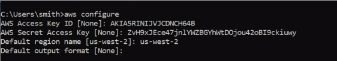

PROYECTO BUCKET S3

parar preparar la instalación de nuestra maquina virtual para poder
 iniciar nuestro bucket s3 en Amazon se necesita 
 
Prime Paso:

-Instalar python dentro del ordenador con el comando en Ubuntu(si tiene
 windows como sistema operativo instalelo manualmente):
	 sudo install python3

-luego en la terminal colocar el comando:
(ubuntu)	
	sudo apt pip install python3-virtualenv
(windows)
	pip install virtualenv

-Ahora para crear tu entorno virtual aplicar el siguiente comando
 dentro de la carpeta deseada
ejemplo("user/home/download/flask-work"):
	1) Dirijase al directorio "flask-work":
	2) coloque en la terminal:		
	-Ubuntu: 
		virtualenv "nombre_de_carpeta" -p python3
	-windows:
		 python -m venv "nombre_del_venv"

	3) En caso haya creado un ven en Windows puede activar el venv
	 de la siguiente forma:
		.\"nombre_del_venv"\Scripts\activate
	 para desactivarlo colocar "deactivate" en la linea de
	 comando(tambien incluye en Ubuntu).

-Con eso listo instalaremos flask dentro de nuestra carpeta env:
ubuntu:
	pip install flask

-Para poder ejecutar flask se necesitan las librerias :
	-sqlite3
	-flask-bootstrap
	-boto3
	-awscli(esto permitirá colocar la configuración de aws services en
	 (terminal)
	-arrow
	-jinja

-Luego de esto se requieren descargar dentro de la carpeta env descargar las librerias, para esto se usa:
	pip install "nombre-libreria"

	Para ver el nombre exacto asi como la version visite https://pypi.org/

ok, con esto listo empecemos

Registrar cuenta aws a la terminal:

para poder acceder al contenedor debemos acceder de manera remota con la terminal el siguiente comando:
	- aws configure

Para esto se debe agregar el la llave de acceso del ID 

Asi como el ACCESS KEY SECRET

luego se configura la region 

Configuración de variables de entorno:
 se configura un archivo llamado ".env", el cual colocaremos 
	S3_BUCKET=""
	S3_KEY=""
	S3_SECRET=""
donde ira las credenciales de su contenedor, asi como su nombre

con eso listo puede modificar este proyecto para su uso posterior, asi como teniendolo de referencia